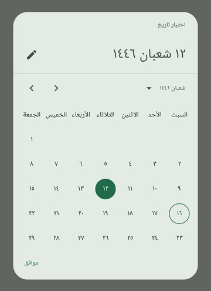
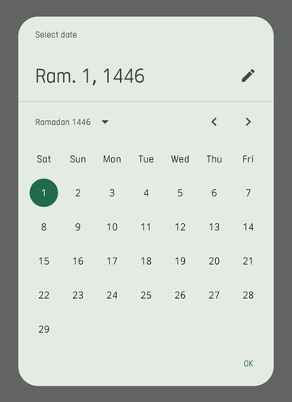
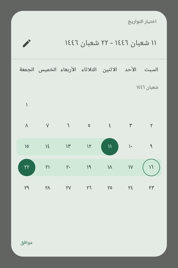
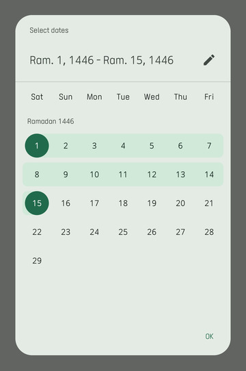
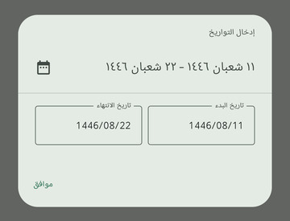
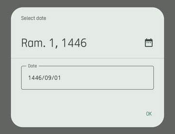

# Hijri Date Picker

[]()
[]()
[](https://www.paypal.com/paypalme/AbdulrahmanBahamel)

A modern and customizable Hijri Date Picker for Android, built with Jetpack Compose and inspired by the Material3 Date Picker.

The **Hijri Date Picker** allows users to select dates in the **Hijri calendar** with ease. It's designed to be **simple, flexible, and customizable**, making it easy for developers to integrate into their apps. This library fills the gap for modern, high-quality date pickers with Hijri calendar support, providing a seamless experience for Muslim users.

---

## Screenshots

Here are examples of the **Hijri Date Picker** in action:

Date Picker (Arabic/English):



Date Range Picker (Arabic/English):



Text Input Variants (Arabic/English):



---

## Table of Contents

- [Features](#features)
- [Usage](#usage)
  - [Single Date Selection](#single-date-picker-dialog)
  - [Date Range Selection](#range-picker-dialog)
- [Installation](#installation)
- [Support Me](#support-me)

---

## Features

- **Modern Design**: Built with Material3 components, providing a sleek, responsive UI.
- **Customizable**: Tailor colors, locales, and other properties to your app's theme.
- **Date Range Support**: Users can select a start and end date seamlessly.
- **Text Input Support**: Manually enter Hijri dates, with validation ensuring valid input.
- **Integration with Java Time API**: Utilizes [HijrahDate](https://docs.oracle.com/en/java/javase/11/docs/api/java.base/java/time/chrono/HijrahDate.html) from the Java Time library for precise Hijri date handling.

---

## Usage

The library provides two main components:

1. **HijriDatePicker**: For single date selection.
2. **HijriDateRangePicker**: For selecting date ranges.

Both are **Composable** components, allowing you to use them as dialogs, bottom sheets, or standalone elements.

### Single Date Picker Dialog

Here’s how to set up the **HijriDatePicker** for selecting a single date:

```kotlin
@Composable
fun DatePickerExample() {
  val datePickerState = rememberHijriDatePickerState(
    initialSelectedDate = HijrahDate.now(), // Default selected date (optional)
    selectableDates = HijriSelectableDates { date ->
      // Allow all dates, but customize this to restrict selectable dates
      true
    },
    initialDisplayMode = DisplayMode.Picker // Start in calendar view (default is Picker)
  )

  var selectDateDialogOpen by remember { mutableStateOf(false) }

  // Render the HijriDatePicker inside a dialog when `selectDateDialogOpen` is true
  if (selectDateDialogOpen) {
    DatePickerDialog(
      onDismissRequest = { selectDateDialogOpen = false },
      confirmButton = {
        TextButton(
          onClick = {
            datePickerState.selectedDate?.let { date: HijrahDate ->
              // Do something with the selected date
            }
            selectDateDialogOpen = false
          },
          content = { Text(stringResource(R.string.ok)) }
        )
      },
    ) {
      HijriDatePicker(
        state = datePickerState,
        /* You can customize some appearance properties */
      )
    }
  }
  
  /*
   * Other code, You can show the dialog by setting `selectDateDialogOpen` to true on a button click or any other event
   */
}
```

---

### Range Picker Dialog

Here’s an example of how to implement a **HijriDateRangePicker** for selecting a date range:

```kotlin
@Composable
fun DateRangePickerExample() {
    var selectRangeDialogOpen by remember { mutableStateOf(false) }

    // State to manage the selected Hijri date range
    val rangePickerState = rememberHijriDateRangePickerState(
        initialSelectedRange = null, // Optional: Pre-select a date range
        selectableDates = HijriSelectableDates { date ->
            // Optional: Implement your own selectable date logic
            true // Select all dates for the range
        },
        //Other params ...
    )
    // Render the HijriDateRangePicker inside a dialog when `selectRangeDialogOpen` is true
  if (selectDateDialogOpen) {
    DatePickerDialog(
      onDismissRequest = { selectDateDialogOpen = false },
      confirmButton = {
        TextButton(
          onClick = {
            val selectedRange: SelectedDateRange? = datePickerState.getSelectedDateRange()
            selectedRange?.let { range: SelectedDateRange ->
              //Do something with the selected date range
            }
            selectDateDialogOpen = false
          },
          content = { Text(stringResource(R.string.ok)) }
        )
      },
    ) {
      HijriDateRangePicker(state = datePickerState /* You can customize some appearance properties */)
    }
  }

  /*
   * Other code, You can show the dialog by setting `selectDateDialogOpen` to true on a button click or any other event
   */
}
```

---

## Installation

### Requirements

- **Jetpack Compose** and **Material3** libraries.
- Minimum SDK: **26**
- JDK: **11 or above**

### Setup

Step 1: Add the Maven Central repository (if not present):

```kotlin
repositories {
    mavenCentral()
}
```

Step 2: Add the library dependency:

#### Kotlin DSL:

```kotlin
dependencies {
    implementation("com.abdulrahman-b.hijridatepicker:hijridatepicker:1.0.1")
}
```

#### Groovy DSL:

```groovy
dependencies {
    implementation "com.abdulrahman-b.hijridatepicker:hijridatepicker:1.0.1"
}
```

---

## Support Me

If you find this project helpful, please support me! Donations are greatly appreciated:

[](https://www.paypal.com/paypalme/AbdulrahmanBahamel)

Thank you for your contributions!